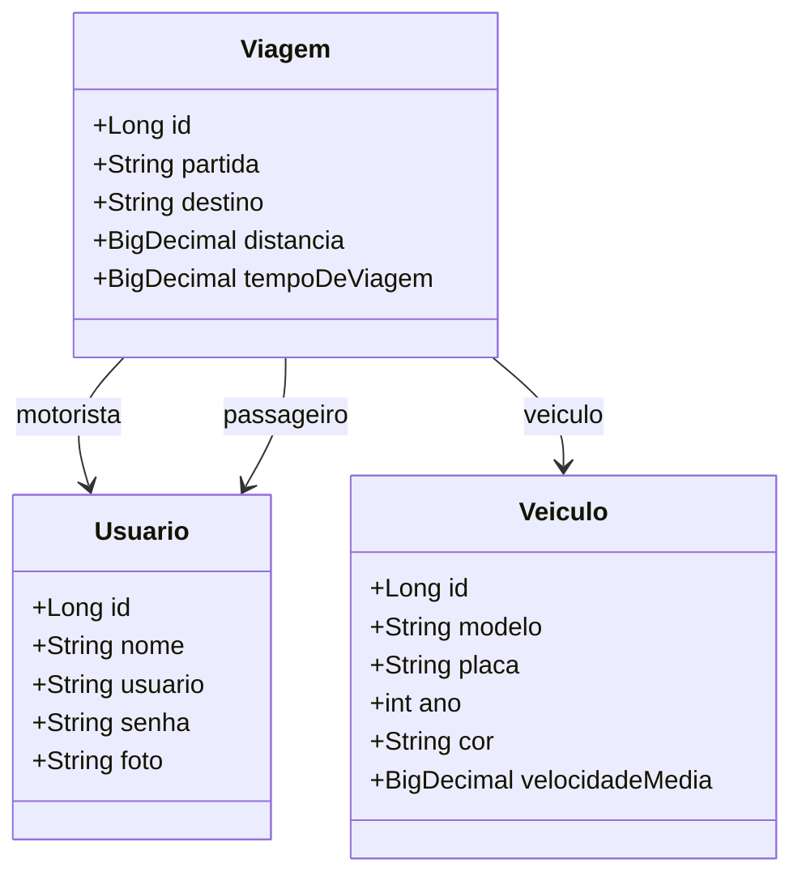
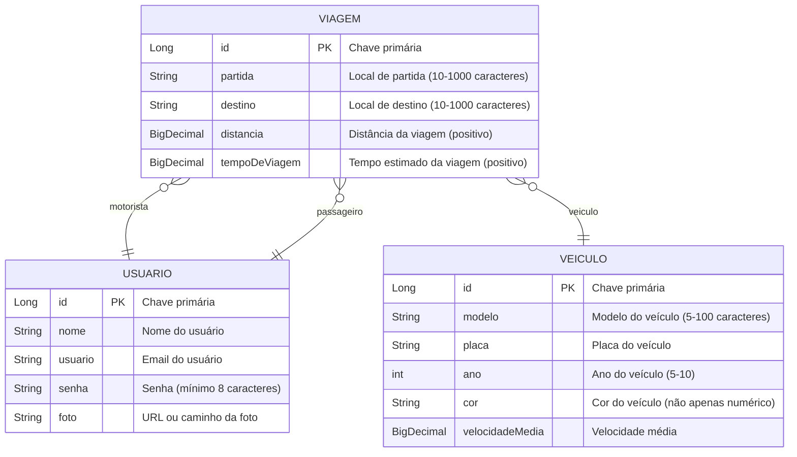

<div align="center">

# RideBro - Backend


</div>
<br />

<div align="center">
    
</div>

---

## Descrição

RideBro é uma API REST em Java com Spring Boot focada no gerenciamento de caronas, permitindo o cadastro de usuários, veículos e viagens.

---

## Sobre esta API

O RideBro é o núcleo de um sistema de gerenciamento de caronas. Desenvolvida com Java e Spring Boot, ela tem como objetivo facilitar a organização de viagens compartilhadas entre usuários, permitindo o cadastro de veículos, controle de usuários e gerenciamento de caronas. A arquitetura modular da API permite fácil manutenção e expansão.

Principais Funcionalidades
🚗 Cadastro e gerenciamento de veículos
Permite criar, editar, listar e excluir veículos utilizados nas caronas.

🧭 Gerenciamento de viagens
Os usuários podem cadastrar, consultar e organizar caronas com origem, destino e horários definidos.

👥 Controle de usuários
Cada carona pode ser associada a um usuário motorista ou passageiro (quando implementado).

🔗 API RESTful com arquitetura MVC
Estrutura organizada em camadas (Model, Controller, Service e Repository) seguindo boas práticas.

📄 Documentação com Swagger
Endpoints documentados para facilitar testes e integração com outras aplicações.

🔧 Base para futuras expansões
Preparada para receber funcionalidades como autenticação, reservas e avaliações de usuários.

---

## Diagrama de Classes



---

## Diagrama Entidade-Relacionamento (DER)



---

## API Endpoints

A API fornece os seguintes endpoints:

VIAGENS:
**GET VIAGENS**

```markdown
GET / viagens - Recuperar uma lista de todas as viagens.
GET / /partida /Rua das Flores - Recuperar uma lista de todas as viagens com base na partida.
GET / /partida /Avenida Paulista - Recuperar uma lista de todas as viagens com base no Destino.
```

```json
[
	{
		"id": 1,
		"usuario": {
			"id": 1,
			"nome": "Eduardo",
			"usuario": "eduardo@email.com",
			"senha": "minhaSenha123",
			"foto": "https://exemplo.com/foto.jpg"
		},
		"veiculo": {
			"id": 1,
			"modelo": "Toyota Corolla",
			"placa": "XYZ9876",
			"ano": 2022,
			"cor": "Azul",
			"velocidadeMedia": 90
		},
		"partida": "Rua das Flores, 123, Nova Odessa",
		"destino": "Avenida Paulista, 456, São Paulo",
		"distancia": 60,
		"tempoDeViagem": 0.67
	},
	{
		"id": 2,
		"usuario": {
			"id": 1,
			"nome": "Eduardo",
			"usuario": "eduardo@email.com",
			"senha": "minhaSenha123",
			"foto": "https://exemplo.com/foto.jpg"
		},
		"veiculo": {
			"id": 1,
			"modelo": "Toyota Corolla",
			"placa": "XYZ9876",
			"ano": 2022,
			"cor": "Azul",
			"velocidadeMedia": 90
		},
		"partida": "Rua das Flores, 123, Nova Odessa",
		"destino": "Avenida Paulista, 456, São Paulo",
		"distancia": 20,
		"tempoDeViagem": 0.22
	}
]
```
```markdown
GET / viagens/distancia/maiorque/20 viagens - Recuperar uma lista de viagens com base na distância.
```
```json
[
	{
		"id": 1,
		"usuario": {
			"id": 1,
			"nome": "Eduardo",
			"usuario": "eduardo@email.com",
			"senha": "minhaSenha123",
			"foto": "https://exemplo.com/foto.jpg"
		},
		"veiculo": {
			"id": 1,
			"modelo": "Toyota Corolla",
			"placa": "XYZ9876",
			"ano": 2022,
			"cor": "Azul",
			"velocidadeMedia": 90
		},
		"partida": "Rua das Flores, 123, Nova Odessa",
		"destino": "Avenida Paulista, 456, São Paulo",
		"distancia": 60,
		"tempoDeViagem": 0.67
	}
]
```
**POST VIAGENS**

```markdown
POST /viagens - Registra uma nova viagem
```

```json
{
  "usuario": {
               "id": 1
            },
  "veiculo": {
               "id": 1
            },
  "partida": "Rua das Flores, 123, Nova Odessa",
  "destino": "Avenida Paulista, 456, São Paulo",
  "distancia": 20
}

```

**UPDATE VIAGENS**

```markdown
PUT /viagens - Atualiza viagem existente
```

```json
{
  "id": 1,
{
  "usuario": {
               "id": 1
            },
  "veiculo": {
               "id": 1
            },
  "partida": "Rua das Aves, 25, Nova Veneza",
  "destino": "Avenida Paulista, 456, São Paulo",
  "distancia": 20
}
```


VEICULOS:

**GET VEICULOS**

```markdown
GET /veiculos - Recuperar uma lista de todos os carros.
```

```json
[
	{
		"id": 1,
		"modelo": "Toyota Corolla",
		"placa": "XYZ9876",
		"ano": 2022,
		"cor": "Azul",
		"velocidadeMedia": 90,
		"viagens": [
			{
				"id": 1,
				"usuario": {
					"id": 1,
					"nome": "Eduardo",
					"usuario": "eduardo@email.com",
					"senha": "minhaSenha123",
					"foto": "https://exemplo.com/foto.jpg"
				},
				"partida": "Rua das Flores, 123, Nova Odessa",
				"destino": "Avenida Paulista, 456, São Paulo",
				"distancia": 60,
				"tempoDeViagem": 0.67
			},
			{
				"id": 2,
				"usuario": {
					"id": 1,
					"nome": "Eduardo",
					"usuario": "eduardo@email.com",
					"senha": "minhaSenha123",
					"foto": "https://exemplo.com/foto.jpg"
				},
				"partida": "Rua das Flores, 123, Nova Odessa",
				"destino": "Avenida Paulista, 456, São Paulo",
				"distancia": 20,
				"tempoDeViagem": 0.22
			}
		]
	},
	{
		"id": 2,
		"modelo": "Toyota Corolla",
		"placa": "XYZ9876",
		"ano": 2019,
		"cor": "Azul",
		"velocidadeMedia": 90,
		"viagens": []
	},
	{
		"id": 4,
		"modelo": "Hyundai HB20",
		"placa": "HJS7822",
		"ano": 2017,
		"cor": "Prata",
		"velocidadeMedia": 60,
		"viagens": []
	}
]
```
```markdown
GET /veiculos /1 - Busca carros pelo ID.
```
```json
{
	"id": 1,
	"modelo": "Toyota Corolla",
	"placa": "XYZ9876",
	"ano": 2022,
	"cor": "Azul",
	"velocidadeMedia": 90,
	"viagens": [
		{
			"id": 1,
			"usuario": {
				"id": 1,
				"nome": "Eduardo",
				"usuario": "eduardo@email.com",
				"senha": "minhaSenha123",
				"foto": "https://exemplo.com/foto.jpg"
			},
			"partida": "Rua das Flores, 123, Nova Odessa",
			"destino": "Avenida Paulista, 456, São Paulo",
			"distancia": 60,
			"tempoDeViagem": 0.67
		},
		{
			"id": 2,
			"usuario": {
				"id": 1,
				"nome": "Eduardo",
				"usuario": "eduardo@email.com",
				"senha": "minhaSenha123",
				"foto": "https://exemplo.com/foto.jpg"
			},
			"partida": "Rua das Flores, 123, Nova Odessa",
			"destino": "Avenida Paulista, 456, São Paulo",
			"distancia": 20,
			"tempoDeViagem": 0.22
		}
	]
}
```

```markdown
GET /veiculos /placa /HJS7822- Busca carros pela placa.
```
```json
[
	{
		"id": 4,
		"modelo": "Hyundai HB20",
		"placa": "HJS7822",
		"ano": 2017,
		"cor": "Prata",
		"velocidadeMedia": 60,
		"viagens": []
	}
]
```
**POST VEICULOS**

```markdown
POST /veiculos - Registra um novo exercício no aplicativo
```

```json
{
  "modelo": "Hyundai HB20",
  "placa": "HJS7822",
  "ano": 2017,
  "cor": "Prata",
  "velocidadeMedia": 60.0
}

```

**UPDATE VEICULOS**

```markdown
PUT /veiculos - Atualiza um veículo existente
```

```json
{
	"id": 1,
  "modelo": "Toyota Corolla",
  "placa": "XYZ9876",
  "ano": 2022,
  "cor": "Azul",
  "velocidadeMedia": 90.0
}
```

USUÁRIOS:

**GET USUÁRIOS**

```markdown
GET /usuarios - Recuperar uma lista de todos os usuários.
```

```json
[
	{
		"id": 1,
		"nome": "Root1",
		"usuario": "Root1@email.com",
		"senha": "minhaSenha123",
		"foto": "https://exemplo.com/foto.jpg",
		"viagens": [
			{
				"id": 1,
				"veiculo": {
					"id": 1,
					"modelo": "Toyota Corolla",
					"placa": "XYZ9876",
					"ano": 2022,
					"cor": "Azul",
					"velocidadeMedia": 90
				},
				"partida": "Rua das Flores, 123, Nova Odessa",
				"destino": "Avenida Paulista, 456, São Paulo",
				"distancia": 60,
				"tempoDeViagem": 0.67
			},
			{
				"id": 2,
				"veiculo": {
					"id": 1,
					"modelo": "Toyota Corolla",
					"placa": "XYZ9876",
					"ano": 2022,
					"cor": "Azul",
					"velocidadeMedia": 90
				},
				"partida": "Rua das Flores, 123, Nova Odessa",
				"destino": "Avenida Paulista, 456, São Paulo",
				"distancia": 20,
				"tempoDeViagem": 0.22
			}
		]
	},
	{
		"id": 2,
		"nome": "Root2",
		"usuario": "Root2@email.com",
		"senha": "minhaSenha123",
		"foto": "https://exemplo.com/foto.jpg",
		"viagens": []
	},
	{
		"id": 3,
		"nome": "Root3",
		"usuario": "Root3@email.com",
		"senha": "minhaSenha123",
		"foto": "https://exemplo.com/foto.jpg",
		"viagens": []
	}
]
```
```markdown
GET /usuarios /1 - Busca usuarios pelo ID.
```
```json
{
"id": 1,
		"nome": "Root1",
		"usuario": "Root1@email.com",
		"senha": "minhaSenha123",
		"foto": "https://exemplo.com/foto.jpg",
		"viagens": [
			{
				"id": 1,
				"veiculo": {
					"id": 1,
					"modelo": "Toyota Corolla",
					"placa": "XYZ9876",
					"ano": 2022,
					"cor": "Azul",
					"velocidadeMedia": 90
				},
				"partida": "Rua das Flores, 123, Nova Odessa",
				"destino": "Avenida Paulista, 456, São Paulo",
				"distancia": 60,
				"tempoDeViagem": 0.67
		   }
	   ]
   }
```
**POST USUÁRIOS**

```markdown
POST /exercicio - Registra um novo exercício no aplicativo
```

```json
{
  "nome": "Root1",
  "usuario": "Root1@email.com",
  "senha": "minhaSenha123",
  "foto": "https://exemplo.com/foto.jpg"
}

```

**UPDATE USUÁRIOS**

```markdown
PUT /exercicio - Atualiza um exercicio existente
```

```json
{
  "id": 32,
  "nome": "Root1",
  "usuario": "Root1_oficial@email.com",
  "senha": "minhaSenha123",
  "foto": "https://exemplo.com/foto.jpg"
}
```

---

## Tecnologias utilizadas

| Item                          | Descrição        |
| ----------------------------- | ---------------- |
| **Servidor**                  | Tomcat           |
| **Linguagem de programação**  | Java             |
| **Framework**                 | Spring Framework |
| **ORM**                       | Hibernate        |
| **Banco de dados Relacional** | MySQL            |

---

## Configuração e Execução

1. Clone o repositório:
   ```bash
   git clone https://github.com/seu-usuario/ridebro-spring.git
   ```
2. Acesse a pasta do projeto:
   ```bash
   cd ridebro-spring
   ```
3. Configure o banco de dados:
   - Edite o arquivo application.properties ou application.yml na pasta src/main/resources
   - Defina as configurações do banco de dados (URL, usuário, senha)
4. Compile o projeto com Maven ou Gradle:

   Maven:

   ```bash
   mvn clean install
   ```

5. Execute a aplicação::
   Maven:
   ```bash
   mvn spring-boot:run
   ```
6. Acesse a API em:

   ```bash
   http://localhost:8080/swagger-ui.html
   ```

7. Use ferramentas como Insomnia ou Postman para testar os endpoints.

## Contribuições

Contribuições são sempre bem-vindas! Se você encontrar algum problema ou tiver sugestões para melhorias, por favor, abra uma issue ou envie um pull request para o repositório.

Ao contribuir, siga o estilo de código já existente e as convenções de commits. Por favor, envie suas alterações em uma branch separada.
